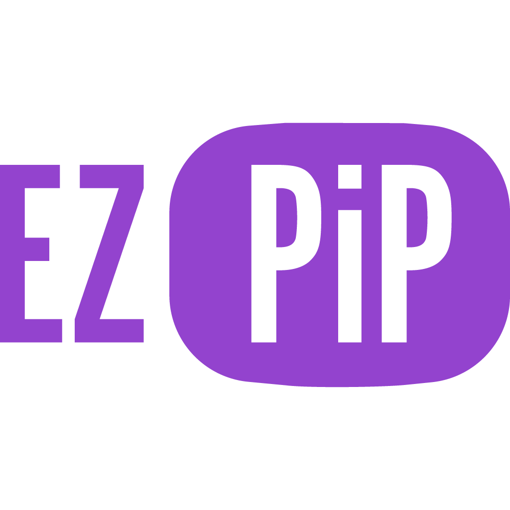
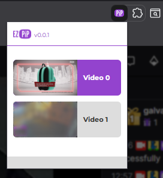

    
    <h1>EZPiP Browser Extension</h1>
    
    
A browser extension to easily put the tab videos in picture-and-picture.

## How to use?
  
Click on the extension icon to view all active tab videos and select one to be PiP.
